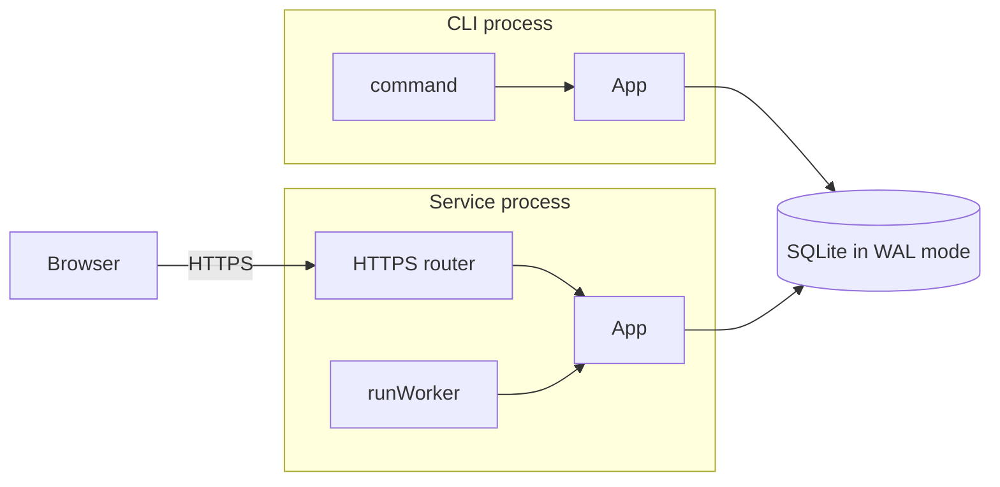
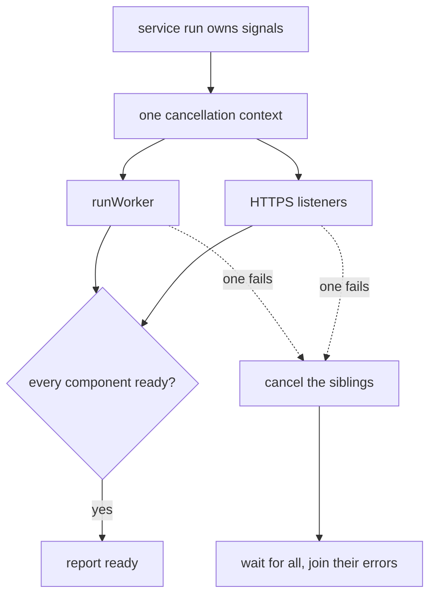
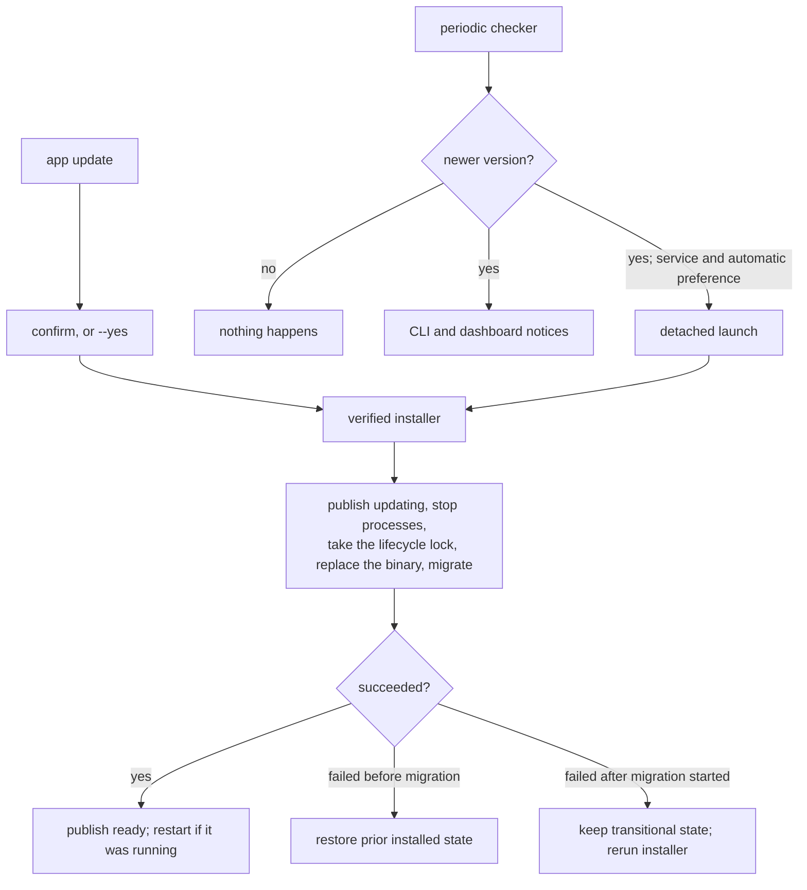
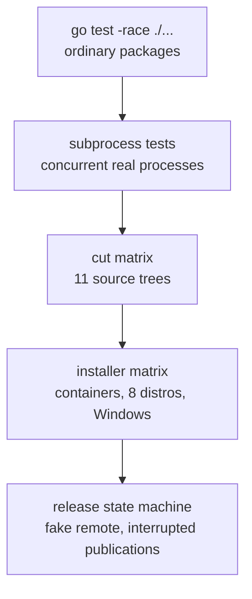

Sprout is one application that can have many instances. These instances are
all CLI commands, including the service itself, which optionally includes the
dashboard. Each is its own process with an `App`, all sharing only a database,
logs, and a small lock and state protocol (more on that later):



## All command start the same

`cmd/main.go` creates an `App` and registers `urfave/cli` commands. Before the
command's action executes:

1. the storage layout is resolved (`internal/layout`);
2. the process checks the lifecycle state, takes the shared lifecycle lock,
   and records its PID marker (`internal/maintenance`);
3. rotating structured logging starts;
4. SQLite opens in WAL mode and verifies that its schema version matches the binary;
5. general configuration is loaded;

These resources are injected into the `App` container. On the way out, they're
cleaned up in reverse order. The command receives a pointer to the `App` so it
can access the resources, classic dependency injection. Errors return to `main`, get
logged, printed, and produce a non-zero exit.

`service status`,  start, stop, restart, etc wrap the `systemd --user`
equivalent. On Windows it's the same except stop and restart. `schtasks` hard
kills processes, so to get graceful shutdown Windows has a separate file it
writes time limited stop requests to. On Windows, the service will check this
every 250ms by default and exit on valid requests. All cases in the codebase
that shutdown the service on Windows use this path, only falling back to
`schtasks /End` after a timeout.

Among the service subcommands is a hidden `service run`. This runs the service
in the foreground and is what `systemd` or `schtasks` calls. It being a command
also is nice for testing, there is a little flag to override the port used as
well. It runs until a shutdown signal is received or the worker / https listener
errors. On such error the returned errors from both components are joined and
returned to main.

## SQLite is where it goes down

The database lives under `data/db/` in the per-user storage root (`~/.<app>`
on Linux, `%LOCALAPPDATA%\<AppName>` on Windows; `docs/MAINTENANCE.md` has the
whole tree). Every CLI process (service included) opens it through
`database/sql`. Bindings / driver
are via `ncruces/go-sqlite3`, a super neat Go module that achieves cgo-free
SQLite by wrapping a Wasm build then translating that to Go.

The driver is a floor, not a ceiling: `go.mod` requires `v0.35.3` or newer, and
on Windows that is a hard minimum rather than a preference. Every earlier
version could corrupt data under heavy multi-process WAL concurrency
([#404](https://github.com/ncruces/go-sqlite3/issues/404)), a bug that had been
there since Windows WAL support landed. Do not go below it.


That fix uses memory placeholders, which need Windows 10 1803 or Server 2019 and
up; on anything older the driver disables shared-memory WAL instead. Sprout
targets Windows 11, so this only matters if your fork reaches further back. In
which case multiple processes sharing one database is the thing to test.


The driver is still `v0.x`, so minor versions *could* break you. Because the
exposed API is plain `database/sql`, worst case the driver is swappable: only
the DSN in `internal/platform/database/database.go` knows which one you picked.

WAL mode allows concurrent readers while SQLite serializes writers. Sprout also
sets a busy timeout and begins write transactions eagerly, which turns brief
cross-process contention into waiting instead of `SQLITE_BUSY` errors.
Each process has a fixed pool of four connections. The bound stays modest
because each Wasm-backed connection owns a separate memory sandbox and more
connections do not make SQLite accept concurrent writers.

The initial schema demonstrates three kinds of state:

- one JSON configuration value behind transactional `View` and `Update`
  accessors;
- dashboard sessions, when HTTPS is retained;
- bounded hash requests, when the service is retained.

The hash command is the IPC example: a CLI process inserts a request, the
worker writes its SHA-256 result, and the CLI reads it back. Replace both sides
with your own protocol, or delete them. SQLite as IPC is the useful idea; the
hash thing is just a cute example, and I like being cute dammit.

Schema changes are ordered functions in
`internal/platform/database/migration.go`. Each database step and its
`PRAGMA user_version` advance commit transactionally. Normal instances fail on
a version mismatch instead of migrating under their shared lock. The installer
is the only production path authorized to run pending migrations; isolated
development builds may initialize a version-zero database automatically.

Adding migrations is very easy and you can put generic code in the steps as
well, not just DB stuff. They're ordered so any install/update will start
at whatever version/position the DB is at. New installs start from 0 and do
all the steps. Be more careful with non-database work: a file write, API call,
or other external side effect cannot share SQLite's rollback. Make that work
idempotent so rerunning an interrupted installer safely converges.

### Why the lifecycle lock exists

Normal app instances/processes hold the shared side of `control/lifecycle.lock`
and leave a PID marker in `control/instances/`. Installers publish a
transitional phase in `control/state.json`, stop those processes, take the
exclusive side of the same lock, run migrations with the new binary, then
restart the service if it had been running.


When stopping the PID tracked processes, the executable is double checked so
unrelated processes are not killed due to a stale PID getting reused after
an instance was hard killed or unable to clean up its marker. After taking
the exclusive lifecycle lock, the installer removes every marker left behind;
the lock proves that no compliant instance can still be using one.


This separates two concerns that look similar but aren't:

- SQLite handles normal concurrent data access.
- The lifecycle lock prevents a binary replacement or schema change while an
  old process is still using the database.

Before changing installed state, the installer atomically replaces
`state.json` with a transitional phase (`installing`, `updating`, or
`uninstalling`) carrying the target version and a fresh one-run nonce for the
new binary. Every running process watches that file and cancels its context
when the phase leaves `ready` or the version or installation epoch changes, so
the published transition is the first drain signal. Normal processes refuse to
start while the phase is transitional, and a `--migrate` process that does not
match phase, target version, and nonce is rejected. Successful migration
returns control to the installer, which publishes `ready` while it still owns
the exclusive lock.

Invoking migration is the point of no return. Before that point, the installer
can restore the previous binary, release source, and service definition. Once
migration may have changed the schema or external state, failure leaves the
transitional phase in place. Rerun the installer to recover; it does not claim
that restoring an old executable would undo a partially applied migration.

If your application must support downgrades, extend the protocol around a
coordinated pre-migration database snapshot and explicit reversal of every
external side effect. Swapping the old executable back is not enough.


If you add non-Sprout processes that open the same database: a Python script,
a sidecar, anything - they have to join this protocol too. Replicate the state
check, shared lock, and PID marker behavior in `internal/maintenance/guard.go`
(and the `state.json` watcher beside it), and teach the installer's shutdown
phase that they exist. As shipped it is deliberately conservative: it walks the
PID markers in `control/instances/` and stops only processes whose executable
path it can match to the installed binary, so a stranger holding the database
open is something it will never notice.


There is no separate runtime directory and nothing under `$XDG_RUNTIME_DIR` or
`/run/user`. Locks, markers, and the state file all live in `control/` inside
the storage root, which survives uninstall alongside `maintenance/` and
`logs/`. Every application-owned directory must be owned by the user with mode
`0700`; unsafe modes and symlinks are rejected rather than quietly repaired.
Windows controllers write an expiring `control/service.stop` lease; the
service coordinator cancels all components and exits before install, restart,
or uninstall falls back to Task Scheduler termination.

## The service

The service starts `runWorker(ctx, app)` and, when retained, the dashboard
listeners as siblings of it. No plugin or register system like commands.



Linux installs a per-user systemd unit and Windows a per-user scheduled task.
Both invoke `service run`. The public `service start`, `stop`, `restart`, and
`status` commands use those platform managers and surface their failures.
Windows doesn't have graceful way to stop tasks, so there's a little dance
we have to do by requesting a shutdown via separate file. On Windows the
service checks the file for valid requests every 250ms. The hard
`schtasks /End` is only used as a fallback after a timeout. Why Microsoft...
why are you braindead and evil.

The foreground entry point holds a process-lifetime operating-system lock,
`control/service.lock`. That makes the service a singleton even if somebody
starts it manually while the managed instance is running. Contention fails
immediately and process exit releases ownership automatically.

The service customization point is pretty straightforward:

```go
func runWorker(ctx context.Context, app *app.App) error
```

Turn it into a bot, scheduler, queue consumer, local protocol server, or
whatever your service actually does. As long as it's not crypto currency or
gambling, in which case it won't work.

The demonstration queue is intentionally single-consumer: the service singleton
lock guarantees there is only one worker process for an installation.

## The dashboard is just another component

The HTTPS feature owns the router, handlers, templates, static assets,
credentials, sessions, permissions, TLS material, and both listeners.

The primary listener always uses HTTPS with a locally generated certificate. An
optional plain HTTP listener exists only for a reverse proxy on loopback;
non-loopback proxy binds are rejected. Both serve the same router. The router
trusts `X-Forwarded-Proto` for the CSRF origin check and the HTTPS redirect
without a proxy allowlist. That is sound only because the header is consulted
when the request arrived without TLS, and the loopback proxy listener is the
only place that can happen; a fork that adds a non-loopback plain listener
must add per-listener trust before relying on the header.

The certificate is an ECDSA P-256 pair generated on first run with SANs for
localhost, loopback, the hostname, and the detected interface addresses. It
lives beside the database in a `0700` directory with a `0600` key, and it is
reused across restarts, so the browser's trust prompt is a one-time event rather
than a daily ritual. An existing pair whose modes have loosened is rejected at
startup rather than repaired; regenerate it by deleting the pair.

Production credentials are created locally by the CLI. Usernames are normalized
and unique, passwords are Argon2id-hashed, and sessions live in SQLite so they
survive restarts and can be revoked from another process. A session is keyed by
the SHA-256 of a 256-bit random cookie token, carries the minting credential's
username and permission bitmask, and expires a fixed 30 minutes after login;
the cookie carries the same lifetime and is HttpOnly, SameSite=Strict, and
Secure outside dev builds. Sessions deliberately don't slide; if your app needs
long-lived logins, design an explicit refresh flow. Login selects one
credential and performs one comparison; unknown usernames take one dummy
comparison so the timing doesn't reveal anything. Each router owns one login
limiter and a small set of password-verification slots. There is no per-IP map
and no throttle on ordinary dashboard requests. Static assets and the login
form are public; settings and control routes require a session. Security headers
wrap every route, while production state-changing requests require an `Origin`
matching the request's host and port plus a JSON content type on JSON endpoints.

This is a decent local dashboard baseline, not a universal security model. To
sum it up, like the release infra, you could do more than this, I wouldn't do
less.. Different applications have wildly different threat models, and a
one-size-fits-all answer would fit nobody. If yours handles anything sensitive,
go read the [OWASP cheat sheet series](https://cheatsheetseries.owasp.org/) and
build on top of this rather than assuming it's finished.

Templates and source assets live under `internal/ui`. Tailwind CSS, DaisyUI,
and esbuild are used without an npm project: CI downloads pinned, verified
executables, and generated CSS and JavaScript receive content hashes and are
embedded into the binary. Local builds may use a `tailwindcss` already on
`PATH` so Nix environments can supply their own; everything else stays pinned
and verified. Esbuild is a static binary, so it works fine on the *special*
child that is Nix.. Additionally there is a flake for setting up their dev
environment.

New development and production configurations bind the dashboard to loopback.
Wildcard and interface-specific binds remain valid explicit LAN opt-ins, and
changing the default does not rewrite a stored bind. The default local build
also sets `DevMode`, which bypasses auth, forces debug logs, disables update
behavior, and uses isolated `-dev` paths. The path bit is important for anything
security related: it reduces the chances of a dev build logging a real
production install's data, which could contain secrets or private state.

## Updates reuse installation

Update capabilities are chosen when finalizing the template. With discovery
retained, the app checks roughly daily and shows notices by default. Applying
updates unattended requires the automatic capability, the service, and an
explicit installation preference.



The update capabilities form a chain: `update` owns discovery and notices;
`update.apply` adds user-requested application; `update.apply.auto` adds
unattended application and also requires the service. Cutting a prerequisite
removes its dependents. Removing all three still leaves installer-driven updates.

Notices and background checks are separate preferences, both enabled by default.
Unattended application is disabled until explicitly enabled with
`<app> update --automatic=true`. Ordinary commands never apply updates in the
background. Hiding notices does not disable checking or unattended application.

Installers persist their effective source in `maintenance/release-url`, including
`APP_RELEASE_URL` mirror overrides. Checks and detached jobs use that source;
the detached job passes it to the installer so future updates remain on the
mirror. The original signing identity is enforced regardless of the source.
A mirror operator stages and approves releases before moving the mirror's
`version` pointer. [End-user mirror]({})
covers publication ordering and retention.

Discovery persists the checked source, latest version, and timestamp. Availability
is derived against the running version and current source. Installer admission
has separate job state and does not clear the discovery result; successful
upgrades and changes of source cannot leave a stale availability flag behind.

Periodic checks claim one expiring database lease shared by every CLI and
service process. Only the owner contacts the release host. On success, the
result and lease removal commit together; on network or cancellation failure,
the lease remains until expiry to prevent a burst of replacement checks.
Explicit checks requested by a user bypass this periodic lease.

The updater runs detached because it may need to stop the calling service and
replace its own executable. It downloads the installer again, verifies its
cosign identity, and leaves shutdown, migration, replacement, pre-migration
recovery, and restart to the normal installer. On Linux it resolves Cosign from
the installer-managed `~/.local/bin/cosign` first, then falls back to `PATH`,
and passes that resolved path to the detached updater.

Each detached job runs from its own `maintenance/jobs/<id>/` directory and
removes it on exit, which is how the admitting process learns the job ended
without draining it (a pre-commit failure, eligible for retry). Because a
runner killed outright never reaches that cleanup, the runner also records its
process identity there and the admitting process probes it: a directory whose
runner is provably dead is reaped and treated as the same failure. See
`docs/MAINTENANCE.md` for the identity check on each platform.

## Releases move forward in durable steps

The build entrypoint is `scripts/build.sh`, which owns the editable project
values and the visible phase order. Focused modules under `scripts/build/` own
common primitives, local artifacts, and remote publication.

Publication is ordered so that every step is safe to be interrupted at:

1. upload the complete release under an immutable `releases/<version>/` prefix;
2. download and verify those remote bytes;
3. publish changed root installers, verified against the current release;
4. replace the root `version` pointer, which is what makes a release public;
5. record the promotion;
6. push the Git tag;
7. apply retention.

Each boundary is provable from remote state alone, which is what lets a fresh
CI run resume rather than start over. Installers read the root pointer once and
pin it, so an install that began before promotion finishes against the release
it started with. The tag comes last because a tag is a claim that something is
already published.

A max of two versions are retained at a time. This allows the installer to pin
the version and not be interrupted mid install / update. The max two release
with a pointer and root installers shape is pretty clever. It allows atomic
releases, even on services that don't support atomic swapping / uploading
(like R2). It allows for the versionless single line install commands. It also
keeps verifying the installers a single optional manual step.

Recovery fails closed wherever state cannot prove what happened: CI refuses to
replace a complete-but-invalid prefix, refuses a promoted version whose prefix
is incomplete, rejects an installer pair it cannot verify, and rejects an
existing tag pointing at a different commit.

[Publish a release]({}) covers this
in better detail.

## Testing the parts that matter

There isn't test framework, the only testing dependency is the standard
library's `testing` package, tests live beside the code they cover, and one
mock in the project (a fake release source). Database tests open real SQLite in
a `t.TempDir()`. Auth tests do real Argon2 comparisons against real sessions,
blah blah, standard stuff.

Testing for this project is difficult. It being a full project
lifecycle means the fragile spooky bits are mainly install related, along
with concurrency stuff. Testing installs is hard cause to do it properly
you kinda need containers / virtual machines. That and a mock for the
CI / publishing interruption / resuming. So there are some extra special
tests in `scripts/` to handel those parts. The tests all assume linux and
Windows relies on the CI for native tests. On top of that the few optional
features mean there are a few source trees to test.

`scripts/test.sh` is the Linux entrypoint for all of them:

```sh
./scripts/test.sh              # ordinary Go tests
./scripts/test.sh -lint        # pinned shellcheck over the shell scripts
./scripts/test.sh -cut         # all supported source shapes
./scripts/test.sh -release     # release state machine
./scripts/test.sh -e2e         # lifecycle end to end, in containers
./scripts/test.sh -all         # everything above
```



### Ordinary Go tests

```sh
./scripts/test.sh
```

That is basically just `go test -race ./...`, no frontend toolchain, no
binary, just embed placeholders so the `//go:embed` directives resolve. It's the
one test command you run constantly. The race detector is also the only reason
the project asks for GCC; the shipped binaries are pure Go.

Roughly 220 test functions across 26 packages. The ones worth knowing about:
`internal/cut` covers the little cutter engine itself (marker parsing,
preview/finalize parity, template ownership, malformed input), `middleware`
covers login, rate limiting, fixed session expiry, and revocation against a
real database, and
`internal/app/commands` has an AST scan that fails if you add a command
constructor and forget to register it.

### Multi-process durability

Concurrency bugs that matter here are between processes, not goroutines, so
those tests spawn real ones: a test re-executes the test binary with
`-test.run` and an environment gate, then several children race on the same
resource under a hard timeout.

- eight processes initializing the same database at once;
- six generating the dashboard's TLS pair on first run, which must agree;
- six writing and rotating the same log file;
- two proving the lifecycle lock's shared side actually blocks the exclusive
  one, and that releasing it lets the installer through.

These are the tests that justify the whole WAL-and-lockfile design. If they pass
you can run as many CLI processes against a running service as you want.

### Every source shape you can cut

```sh
./scripts/test.sh -cut
```

The dependency graph has eleven valid update/service combinations. Both Linux
and Windows matrices enumerate those combinations from the cutter's feature
definitions. For each one the harness copies the repo to a temp directory, runs `scripts/cut --finalize`
with a replacement module path and that variant's feature list, bundles the
frontend when the dashboard survived, syntax-checks the surviving `install.sh`,
and runs `go test -race ./...` inside it. A cut or rename that leaves an unused
import, an orphaned call, or a test referencing deleted code fails here rather
than in your fork.

Finalization deletes this harness and the cutter automatically during
[step 3]({}). They exist only for the
template's own development.

### Installers, on other distros

```sh
./scripts/test.sh -e2e                          # all distros
./scripts/test.sh -e2e --distros "alpine void"  # just these
```

The harness builds a production-mode binary, assembles a fake versioned release
directory, and mounts it read-only inside unprivileged Incus system containers
for installation over `file://` with `APP_SKIP_VERIFY=true`. That variable skips
cosign signature verification and exists solely for this; the SHA-256 checks
still run. Default coverage is Debian, Ubuntu, Fedora, Arch, Alpine, openSUSE,
Void, and Rocky, plus a fake immutable-root scenario that checks the installer
suggests Homebrew or distrobox instead of `dnf`. For a full list of considered
distros, see
[step 6]({}).

On systemd distributions the container boots systemd as PID 1, creates a
persistent user manager with linger, and exercises the real generated unit.
The test checks direct machine-readable `systemctl --user` state, the app's
`service status` wrapper, a worker-backed exact hash result, and the public
HTTPS `/healthz` response. Every managed case repeats those probes after a
wrapper restart and reinstall over the active service; Debian also repeats them
after an injected migration failure and recovery. The checks reject any
crash-loop restart.

The hash assertion deliberately exercises the template's SQLite IPC example.

Alpine and Void deliberately cover the binary-only degradation when
`systemd --user` is unavailable. Every case asserts the storage tree: `0700`
directories, `0600` state and lock files, `maintenance/release-url` present or
absent as the scenario demands, and no stray `run/` directory. Temporary
no-update, no-service, and headless cuts cover the installer paths that
actually differ.
Incus system containers share the host kernel, so this validates full distro
userspaces and init behavior, not a distinct guest kernel.

Every invocation keeps separate per-case output under
`out/lifecycle-e2e-logs/<run>/`. Set `KEEP_FAILED=true` to retain failed Incus
instances for interactive inspection; the harness prints each retained instance
name and preserves the temporary host directory backing its `/harness` and
`/release` mounts. Passing instances are still removed normally.

`scripts/test-lifecycle-e2e.ps1` is the Windows equivalent: it serves a fake release
over loopback HTTP, installs, upgrades over itself, confirms unrelated processes
survive while stale markers are cleaned, checks the scheduled task stops
gracefully through the stop lease, and asserts the installer reads the root
`version` pointer exactly twice during an upgrade. That last assertion is the
pinning contract from the release section, written down as a number.

### The release state machine

```sh
./scripts/test.sh -release
```

Publication can be "interrupted" and is tested with its own harness: an
rclone local backend stands in for the bucket and a small script stands in for
cosign, which makes the entire state machine testable in seconds without
touching a real remote. It walks the failure cases the design promises to
survive, resuming an incomplete prefix, promoting twice, recovering an
interrupted two-object installer replacement, refusing an installer pair it
cannot explain, refusing to move the pointer backward, re-tagging, rejecting a
tag that points at a different commit, and both sides of the newest-two-plus-24
hour retention rule.

### What CI actually runs

Each workflow starts with a tiny `ci-gate` job. Unless the repository variable
`CI_ENABLED` is exactly `true`, that job reports the disabled state and every
checkout, build, test, and deployment job is skipped successfully. Once
enabled, three validation jobs run for pull requests targeting `main` and again
after a push to `main`. A fourth publication job is eligible only on pushes,
and only that job needs release secrets:

- **cut-matrix** - the 11 trees above.
- **lifecycle-e2e** - the race-enabled Go suite on Linux, shellcheck over the
  shell scripts, the release state machine, then the container lifecycle run
  for a representative distro subset.
- **windows-test** - the Go suite natively on Windows, representative source
  cuts, both PowerShell scripts parsed by Windows PowerShell 5.1, and the
  installer harness against a freshly rendered installer candidate.
- **release** - push-only, needs the other three to pass, and is the only job
  that can write to your bucket or push a tag.

Fresh forks are inert by default. Local commands provide the same validation
before CI is enabled, without spending hosted-runner minutes or accidentally
deploying from an unconfigured template.

## Code minimap

- `cmd/main.go` - process entry, global flags, and final error handling.
- `internal/app` - the `App` composition root, cleanup stack, update checks,
  and maintenance job admission.
- `internal/app/commands` - CLI commands, service coordination, and the worker
  customization point.
- `internal/maintenance` - lifecycle lock, `state.json`, detached installer
  launch, and the service singleton lock.
- `internal/layout` - every filesystem path and its permission policy.
- `internal/platform/database` - SQLite setup, schema, and focused accessors.
- `internal/platform/http` - dashboard listeners, routing, auth, and handlers.
- `internal/platform/secrets` - TLS material generation and storage.
- `internal/ui` - embedded templates and frontend sources.
- `internal/build` - values injected into a binary at build time.
- `pkg` - small reusable packages for locks, rotating logs, migrations, HTTP,
  crypto, prompts, and systemd notification.
- `scripts/build.sh`, `scripts/build/`, and `scripts/vendor.sh` - local
  builds, remote releases, and pinned third-party tools.
- `scripts/test.sh` and `scripts/test-*` - Go, source-shape, release, and
  installer tests.
- `scripts/install.sh` and `scripts/install.ps1` - per-user
  install, update, pre-migration rollback, and recovery.
